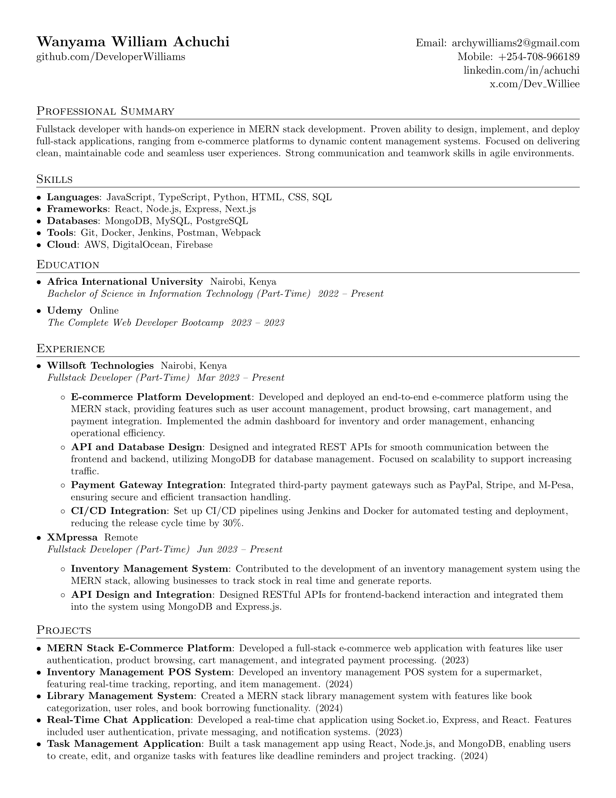

#  Developer Resume(Curriculum Vitae)


This repository contains the source code for my CV, which is written in LaTeX.

## Files

- `cv.tex`: The main LaTeX file for the CV.
- `cv.pdf`: The compiled PDF version of the CV.
- `README.md`: This file.

## Requirements

To compile the LaTeX file, you need to have a LaTeX distribution installed. I recommend [TeX Live](https://www.tug.org/texlive/) for Linux and macOS users, and [MiKTeX](https://miktex.org/) for Windows users.

## Compilation

To compile the `cv.tex` file into a PDF, use the following command:

```sh
pdflatex cv.tex
```

## License

This project is licensed under the MIT License. See the [LICENSE](LICENSE) file for details.
This repository contains the source code for my CV, which is written in LaTeX.

## Files

- `cv.tex`: The main LaTeX file for the CV.
- `cv.pdf`: The compiled PDF version of the CV.
- `README.md`: This file.
- `William-CV-1.png`: This file.

## Requirements

To compile the LaTeX file, you need to have a LaTeX distribution installed. I recommend [TeX Live](https://www.tug.org/texlive/) for Linux and macOS users, and [MiKTeX](https://miktex.org/) for Windows users.

## Compilation

To compile the `cv.tex` file into a PDF, use the following command:

```sh
pdflatex cv.tex
```

## License

This project is licensed under the MIT License. See the [LICENSE](LICENSE) file for details.